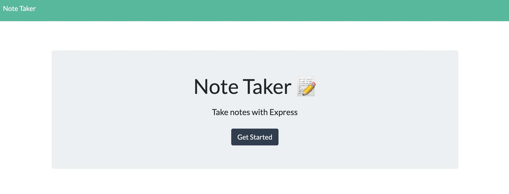
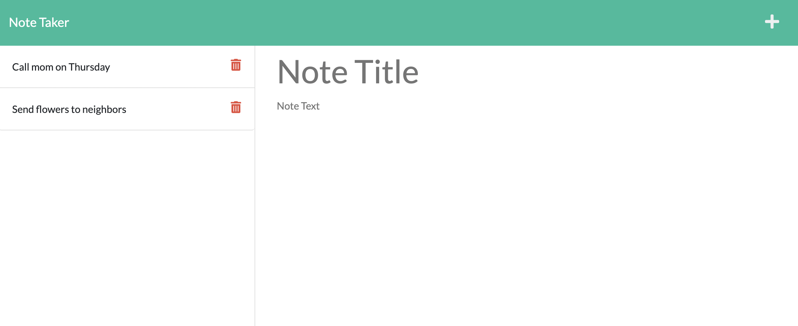
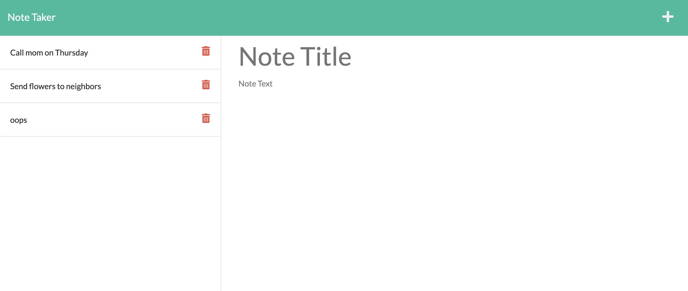

# Note Taker 
## Description
Upon deployment, this app will take you to the main page that asks you to get started. After clicking the button, the user is sent to another HTML, which asks for a note title, as well as content. Then the user should click the save button and the note will show up in the sidebar queue. If user decides that they want to delete a note, they simply click on the trash bin to the corresponding note and it will be removed. 

When you open the app, this is the landing page:

After entering into the app, you are shown a page that has two example notes on it as well as a space to create your own.

If you make a mistake note, you can easily delete so that it shows the notes that you want to remain.

## Deployment
You can try out the app at this [link](https://kelliekumasaka-note-taker.herokuapp.com/).

## Table of Contents
* [Installation](#installation)
* [Usage](#usage)
* [Contributing](#contributing)
* [Tests](#tests)
* [License](#license)
* [Questions](#questions)

## Installation
Install express to run this server.

## Usage

## Contributing

## Tests

## License
This project is licensed under MIT.

## Questions
Here is a link to my [GitHub](https://github.com/kelliekumasaka) or shoot me an [email](mailto:kelliek3@uw.edu).